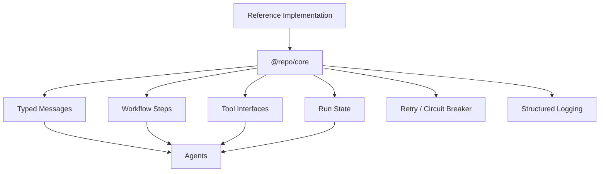

# @repo/core

Reusable **runtime primitives** for workflows, agents, multi-agent orchestration, tools, retries, durable run state, and typed messages.

## Core Package Role

`@repo/core` gives reference implementations **small, typed building blocks** (messages, workflow steps, tool contracts, run state, resilience, logging) so agent-shaped code does not reimplement the same glue in every flagship.

`@repo/core` provides reusable runtime primitives for workflows, agents, and multi-agent systems. It should stay **small**, **typed**, and **implementation-agnostic** (no vendor SDKs here — adapters live in apps).

**Versioning:** **`0.x`** — breaking changes may occur while reference implementations and the catalog evolve together. Pin a lockfile commit or version range in consuming apps.

**Status:** first practical slice — types, tools (Zod-shaped), sequential workflows, agent message shapes, in-memory run state, retry/backoff, circuit breaker, JSON logging, and OTel-shaped tracing hooks.

## Scripts

- `pnpm typecheck` — `tsc --noEmit` (strict)
- `pnpm test` — `vitest run`

## Dependencies

- **zod** — `ToolDefinition` / `ToolInput` / `ToolOutput` use `z.ZodTypeAny` and `z.infer` for schema-safe typing.

## Non-goals

- Not a full agent framework or orchestration engine.
- No vendor-specific LLM SDKs in this package (keep adapters elsewhere).
