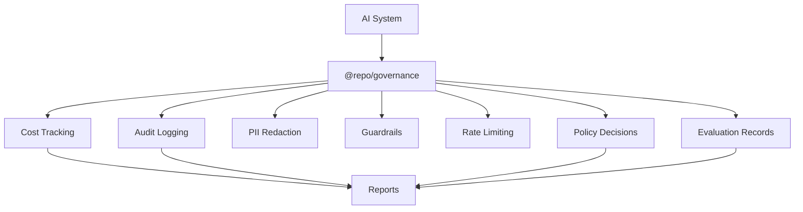

# @repo/governance

Reusable **reference governance layer** for TypeScript AI systems: cost estimation from token usage, structured audit logging, heuristic PII redaction, input/output guardrails, in-memory rate limiting, policy decision records, and lightweight eval run shapes.

## Governance Package Role

This package provides **reference governance primitives**. It does **not** certify an application as **HIPAA**, **SOX**, **GDPR**, **FINRA**, or otherwise **compliant** — pair with organizational controls and professional review.

## Important disclaimer

This package provides **patterns and building blocks for engineering**, not certifications. It does **not** satisfy **HIPAA**, **SOX**, **GDPR**, or other **compliance obligations** for your applications — it offers **reference controls** you may adapt with legal and security review. Heuristic PII detection is **not** a Data Loss Prevention (DLP) product. **Legal, security, and compliance sign-off** are required before production use in regulated environments.

## Scripts

- `pnpm typecheck`
- `pnpm test`

## Modules

| Module | Purpose |
|--------|---------|
| `cost-tracker` | `calculateCost`, `aggregateCostByRun` with caller-owned `PricingConfig` |
| `audit-logger` | `AuditEvent`, `AuditLogger`, `InMemoryAuditLogger` |
| `pii-redactor` | `detectPII`, `redactPII` (reference heuristics only) |
| `guardrails` | `runInputGuardrails`, `runOutputGuardrails` |
| `rate-limiter` | `InMemoryTokenBucketLimiter` (single process) |
| `policy-decision` | `PolicyDecision`, `DecisionReason`, `recordPolicyDecision` |
| `eval-record` | `EvalRun`, `EvalResult`, `EvalMetric` |

## Non-goals

- Not a policy engine, billing system, or SIEM.
- Not a substitute for vendor DLP, secrets scanning, or enterprise IAM.
