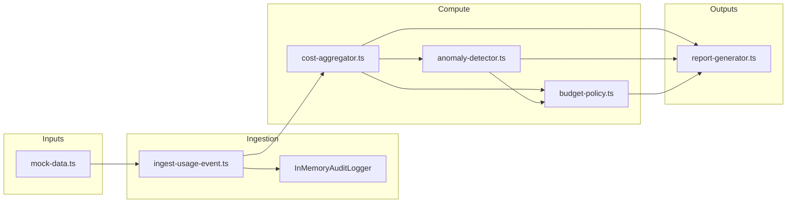

# Architecture — AI Cost Monitoring Engine (reference)

This document describes the **demo implementation** under `reference-implementations/ai-cost-monitoring-engine/`.  
The canonical product narrative remains in  
[`projects/devtools/ai-cost-monitoring-engine`](../../projects/devtools/ai-cost-monitoring-engine/).

---

## 1. Text data flow

**Narrative:** synthetic usage rows are validated, enriched with a **governance-derived cost estimate**, appended to an in-memory store, and mirrored into an **audit log**. Rollups feed **anomaly rules** and **budget advisory** logic before reports are rendered.

---

## 2. Modules (code map)

| File | Responsibility |
|------|------------------|
| `src/types.ts` | `UsageEvent`, `EnrichedUsageEvent`, `CostRollups` |
| `src/mock-data.ts` | Demo `PricingConfig` + `mockUsageEvents()` |
| `src/ingest-usage-event.ts` | Validation, `calculateCost`, `UsageEventStore`, audit side effects |
| `src/cost-aggregator.ts` | Deterministic maps for project/model/run/day |
| `src/anomaly-detector.ts` | Heuristic findings (not ML) |
| `src/budget-policy.ts` | Advisory actions from spend + latency signals |
| `src/report-generator.ts` | Markdown + JSON summaries |
| `src/index.ts` | `runDemoReport()` + CLI entry |

Tests live under `tests/`; the micro-benchmark lives under `benchmarks/`.

---

## 3. Governance integration

| Concern | Where | Notes |
|---------|-------|------|
| Cost estimate per event | `@repo/governance` `calculateCost` | Pricing table is **caller-owned** (`demoPricing()` today). |
| Auditability | `@repo/governance` `InMemoryAuditLogger` | Demonstrates structured fields (`runId`, `actor`, `action`, `resource`, `metadata`). Replace with durable append-only storage. |
| PII / deeper policy | *Not wired in this slice* | If logs may contain user text, run `@repo/governance` `redactPII` before persistence. |

**Disclaimer:** `@repo/governance` is a **reference layer**, not compliance software. Legal and security review are still required for regulated production.

---

## 4. Observability points (where to hook OTel)

Recommended **first spans** when you graduate beyond the demo:

1. **Ingest path** — one span per accepted event (attributes: `projectId`, `model`, token counts, `latencyMs`, `cost.total`).
2. **Aggregation job** — span around `aggregateCosts` / warehouse upsert with batch size.
3. **Anomaly scan** — span per detector pass with counts of findings.
4. **Report generation** — lightweight span for latency of Markdown/JSON export.

Recommended **metrics** (counters / histograms):

- `ingest_events_total{result}` — `accepted` vs `rejected`.
- `rollup_lag_seconds` — time from event timestamp to rollup visibility (future when async).
- `anomaly_findings_total{type}` — spike vs latency vs token surge.

Recommended **logs** (structured JSON):

- Correlate with `runId` and `projectId` from `UsageEvent`.
- Never log raw prompts by default; if you must, redact first.

See [`PRODUCTION_GUIDE.md`](./PRODUCTION_GUIDE.md) for OpenTelemetry wiring guidance.

---

## 5. Failure modes (demo + production carryovers)

| Failure | Demo behavior | Production mitigation |
|---------|---------------|------------------------|
| Missing / unknown model in pricing | `calculateCost` throws | Maintain a `fallback` entry + alerts for unknown models; quarantine events. |
| Poison / negative token counts | `UsageEventSchema` / `ingest` rejects | Zod (or equivalent) at HTTP edge; dead-letter queue for async workers. |
| Duplicate delivery | Not handled (in-memory append) | Idempotency keys per `(provider, requestId)` before insert. |
| Clock skew | Day buckets use event `timestamp` as given | Normalize to UTC at producers; monitor skew between gateway and worker. |
| Over-broad anomaly heuristics | Possible false positives | Tune thresholds per environment; track precision/recall of alerts over time. |
| Policy actions misfire | Recommendations only — no enforcement | Separate **decision** from **execution**; require human approval for destructive actions. |

---

## 6. Non-goals for this reference folder

- Multi-region HA, multi-tenant isolation, or full RBAC.
- Provider invoice reconciliation.
- ML-based anomaly detection or auto-remediation without human gates.
